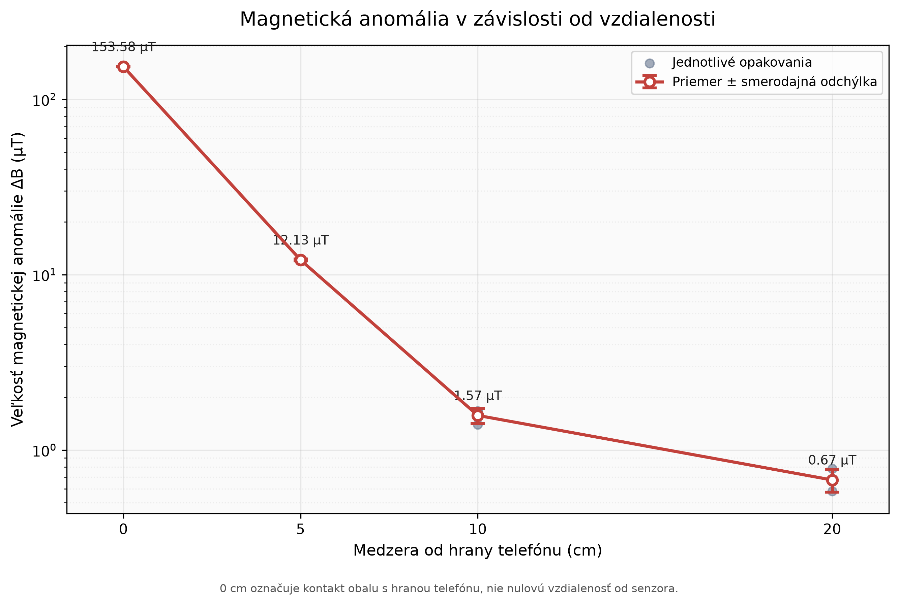
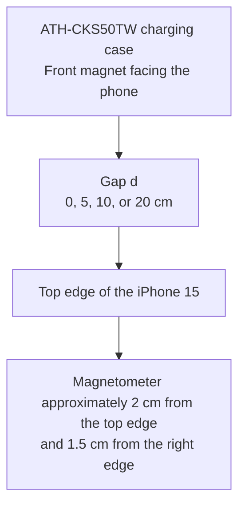

# Magnetic Anomaly Hunter

An experimental Python project investigating how the magnetic field measured by a smartphone changes as the gap between the phone and the built-in magnet of an Audio-Technica ATH-CKS50TW charging case increases.

The project loads the original magnetometer exports, validates and processes the data, calculates the vector deviation from the background field, and automatically generates the final chart.

## AI assistance disclosure

This project was developed with substantial assistance from AI (OpenAI ChatGPT/Codex). AI assisted with the project architecture, Python implementation, automated tests, data analysis, visualization, and documentation.

The repository owner designed and performed the physical experiment, collected the measurement data, supplied the experimental decisions, ran the code and tests, and reviewed the generated outputs and conclusions. This repository should therefore be understood as an AI-assisted learning project, not as work produced independently without AI.



## Research question

How does the magnitude of the magnetic-field vector deviation from the background change as the gap between the front of the ATH-CKS50TW charging case and the edge of the smartphone increases?

## Hypothesis

The magnitude of the magnetic anomaly will decrease as the distance increases.

## Results

The values below represent the mean and sample standard deviation of three repeated measurements.

| Gap from the phone edge | Magnetic anomaly |
|---:|---:|
| 0 cm | 153.585 ± 0.284 µT |
| 5 cm | 12.125 ± 0.174 µT |
| 10 cm | 1.574 ± 0.156 µT |
| 20 cm | 0.674 ± 0.101 µT |

The reference magnetic field changed by approximately **2.229 µT** between the beginning and the end of the experiment.

The experiment therefore clearly detected a magnetic anomaly at gaps of 0 cm and 5 cm. The values measured at 10 cm and 20 cm are smaller than the observed background drift, so the current experimental setup cannot reliably distinguish them from changes in the surrounding magnetic field.

## Measurement geometry

The iPhone 15 remained horizontal at a marked position on a table. The charging case was placed with its front magnet facing the top edge of the phone and was moved directly away from it.



A gap of 0 cm means that the case was touching the edge of the phone. It does not mean that the distance between the magnet and the sensor was zero.

## Measurement protocol

- The phone remained at the same marked position throughout the experiment.
- The orientation of the phone and the charging case did not change.
- The independent variable was the gap from the edge of the phone.
- Measurements were taken at gaps of 0 cm, 5 cm, 10 cm, and 20 cm.
- Each distance was measured three times.
- The background field was measured before and after the experiment.
- Each measurement was planned to last 15 seconds; the exported records contain approximately 11 to 13 seconds of data.
- Magnetic-field values are expressed in microteslas (µT).
- A total of 14 records and 16,549 samples were processed.

## Anomaly calculation

Each measurement contains three components of the magnetic field:

- `field_x_ut`
- `field_y_ut`
- `field_z_ut`

The mean field vector is calculated for each measurement. The reference background vector is the mean of the initial and final background measurements.

The anomaly vector is defined as:

```text
ΔBx = Bx_measurement - Bx_background
ΔBy = By_measurement - By_background
ΔBz = Bz_measurement - Bz_background
```

Its magnitude is calculated as:

```text
ΔB = sqrt(ΔBx² + ΔBy² + ΔBz²)
```

The calculation uses the difference between vectors rather than only the difference between their magnitudes. Depending on its orientation, the investigated magnet can either increase or decrease the total measured field magnitude.

## Project structure

```text
magnetic-anomaly-hunter/
├── data/
│   ├── raw/
│   │   └── Anomaly_Hunter.zip
│   └── processed/
│       ├── measurements.csv
│       ├── run_summary.csv
│       ├── background_summary.csv
│       ├── anomaly_runs.csv
│       └── distance_summary.csv
├── docs/
│   ├── Lovec_magnetickych_anomalii.pdf
│   └── technical_report.md
├── figures/
│   └── anomaly_vs_distance.png
├── src/
│   └── magnetic_anomaly_hunter/
│       ├── loader.py
│       ├── processor.py
│       ├── analysis.py
│       ├── visualization.py
│       └── pipeline.py
├── tests/
├── requirements.txt
└── README.md
```

## Installation

The project uses Python 3.12.

```bash
git clone https://github.com/Fironman-code/magnetic-anomaly-hunter.git
cd magnetic-anomaly-hunter

python3 -m venv .venv
source .venv/bin/activate

python -m pip install -r requirements.txt
```

## Reproducing the results

The complete analysis—from the original ZIP archive to the final chart—can be run with a single command:

```bash
PYTHONPATH=src python -m magnetic_anomaly_hunter.pipeline
```

This command:

1. loads all 14 nested ZIP exports;
2. validates the schema, numeric types, and missing values;
3. creates the processed `measurements.csv` file;
4. calculates a summary of each measurement;
5. creates the reference background vector;
6. calculates the anomaly for each repeat;
7. summarizes the results by distance;
8. generates the final chart.

## Tests

```bash
PYTHONPATH=src python -m pytest -q
```

The project includes 16 automated tests covering:

- loading and counting the nested archives;
- validation of required columns;
- detection of missing and non-numeric values;
- metadata assigned to individual measurements;
- creation of the processed CSV file;
- calculation of vector differences;
- aggregation of repeated measurements;
- creation of the result tables;
- generation of the chart;
- complete reproduction of the project from the original archive.

## Raw-data protection

The `data/raw/Anomaly_Hunter.zip` file is never modified programmatically. All derived files are created in `data/processed/`.

The `backgorund_end` typo remains preserved in the original archive. The loader normalizes it to `background_end` during processing.

## Main limitations

1. The background drift of 2.229 µT is greater than the calculated anomaly at 10 cm and 20 cm.
2. The measured quantity was the gap from the edge of the phone, not the exact distance between the magnet and the sensor.
3. Small changes in the position or orientation of the charging case affect the individual vector components.
4. Nearby metal objects and electronics may have influenced the reference field.
5. A smartphone magnetometer is not a calibrated laboratory instrument.

## Proposed follow-up experiment

Use a non-conductive, non-magnetic fixture to hold both the phone and the charging case in fixed positions. At every distance, perform the measurements in the following order:

```text
background → magnet → background
```

This procedure would make it possible to estimate the drift separately at each distance and determine whether the weak values measured at 10 cm and 20 cm originate from the investigated magnet or from changes in the surrounding magnetic field.
