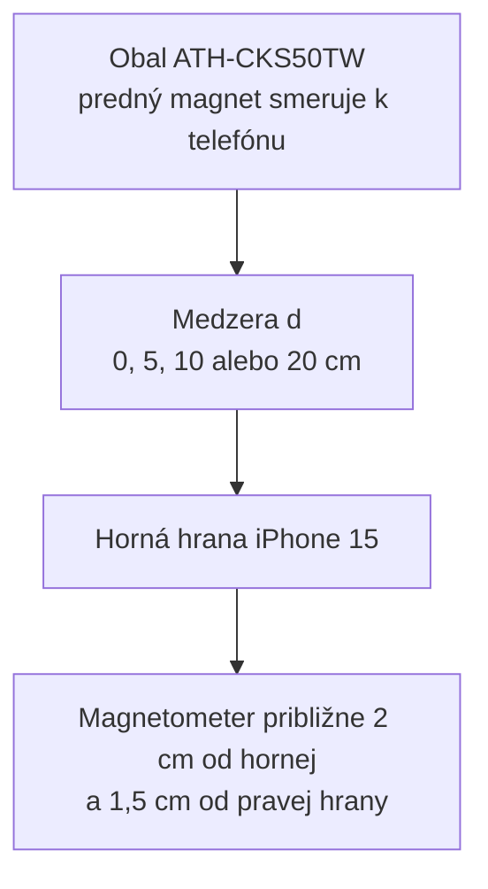

# Lovec magnetických anomálií

Experimentálny Python projekt skúmajúci, ako sa mení magnetické pole namerané telefónom pri zväčšovaní vzdialenosti od magnetu v obale slúchadiel Audio-Technica ATH-CKS50TW.

Projekt načíta pôvodné exporty magnetometra, skontroluje ich, vytvorí spracované dáta, vypočíta vektorovú odchýlku od pozadia a automaticky vygeneruje výsledný graf.


## Výskumná otázka

Ako sa mení veľkosť vektorovej odchýlky magnetického poľa od pozadia pri zväčšovaní medzery medzi prednou stranou obalu ATH-CKS50TW a hranou telefónu?

## Hypotéza

So zväčšujúcou sa vzdialenosťou bude veľkosť magnetickej anomálie klesať.

## Výsledky

Hodnoty predstavujú priemer a výberovú smerodajnú odchýlku troch opakovaní.

| Medzera od hrany telefónu | Magnetická anomália |
|---:|---:|
| 0 cm | 153,585 ± 0,284 µT |
| 5 cm | 12,125 ± 0,174 µT |
| 10 cm | 1,574 ± 0,156 µT |
| 20 cm | 0,674 ± 0,101 µT |

Zmena referenčného magnetického poľa medzi začiatkom a koncom experimentu bola približne **2,229 µT**.

Meranie preto presvedčivo zachytilo magnetickú anomáliu pri medzere 0 cm a 5 cm. Hodnoty pri 10 cm a 20 cm sú menšie než zistený drift pozadia, takže ich súčasný experiment nedokáže spoľahlivo odlíšiť od zmeny prostredia.

## Meracia geometria

Telefón iPhone 15 ležal vodorovne na označenom mieste na stole. Obal slúchadiel bol otočený prednou stranou s magnetom k hornej hrane telefónu a posúval sa priamo od nej.



Hodnota 0 cm znamená kontakt obalu s hranou telefónu. Neznamená nulovú vzdialenosť medzi magnetom a senzorom.

## Merací protokol

- telefón zostal počas všetkých meraní na rovnakom označenom mieste;
- orientácia telefónu a obalu sa nemenila;
- meraná premenná bola medzera od hrany telefónu;
- použité medzery boli 0 cm, 5 cm, 10 cm a 20 cm;
- každá vzdialenosť bola zmeraná trikrát;
- pozadie bolo zmerané pred experimentom aj po ňom;
- meranie bolo plánované na 15 sekúnd, pričom exportované záznamy obsahujú približne 11 až 13 sekúnd dát;
- jednotkou magnetického poľa je mikrotesla (µT);
- celkovo bolo spracovaných 14 záznamov a 16 549 vzoriek.

## Výpočet anomálie

Každé meranie obsahuje tri zložky magnetického poľa:

- `field_x_ut`
- `field_y_ut`
- `field_z_ut`

Pre každé opakovanie sa najprv vypočíta priemerný vektor poľa. Referenčný vektor pozadia je priemer počiatočného a koncového merania pozadia.

Vektor anomálie je:

```text
ΔBx = Bx_meranie - Bx_pozadie
ΔBy = By_meranie - By_pozadie
ΔBz = Bz_meranie - Bz_pozadie
```

Jeho veľkosť sa vypočíta:

```text
ΔB = sqrt(ΔBx² + ΔBy² + ΔBz²)
```

Používa sa rozdiel vektorov, nie iba rozdiel absolútnych hodnôt. Magnet skúmaného predmetu totiž môže podľa svojho smeru celkovú nameranú veľkosť poľa zvýšiť aj znížiť.

## Štruktúra projektu

```text
magnetic-anomaly-hunter/
├── data/
│   ├── raw/
│   │   └── Anomaly_Hunter.zip
│   └── processed/
│       ├── measurements.csv
│       ├── run_summary.csv
│       ├── background_summary.csv
│       ├── anomaly_runs.csv
│       └── distance_summary.csv
├── docs/
│   ├── Lovec_magnetickych_anomalii.pdf
│   └── technical_report.md
├── figures/
│   └── anomaly_vs_distance.png
├── src/
│   └── magnetic_anomaly_hunter/
│       ├── loader.py
│       ├── processor.py
│       ├── analysis.py
│       ├── visualization.py
│       └── pipeline.py
├── tests/
├── requirements.txt
└── README.md
```

## Inštalácia

Projekt používa Python 3.12.

```bash
git clone https://github.com/Fironman-code/magnetic-anomaly-hunter.git
cd magnetic-anomaly-hunter

python3 -m venv .venv
source .venv/bin/activate

python -m pip install -r requirements.txt
```

## Reprodukcia výsledkov

Celý analytický postup od pôvodného ZIP archívu až po výsledný graf sa spustí jedným príkazom:

```bash
PYTHONPATH=src python -m magnetic_anomaly_hunter.pipeline
```

Tento príkaz:

1. načíta všetkých 14 vnorených ZIP exportov;
2. overí schému, číselné typy a chýbajúce hodnoty;
3. vytvorí spracovaný súbor `measurements.csv`;
4. vypočíta súhrn jednotlivých meraní;
5. vytvorí referenčný vektor pozadia;
6. vypočíta anomáliu pre každé opakovanie;
7. zhrnie výsledky podľa vzdialenosti;
8. vytvorí výsledný graf.

## Testy

```bash
PYTHONPATH=src python -m pytest -q
```

Projekt obsahuje 16 automatických testov kontrolujúcich:

- počet a načítanie vnorených archívov;
- povinné stĺpce;
- chýbajúce a nečíselné hodnoty;
- metadáta jednotlivých meraní;
- vytvorenie spracovaného CSV;
- výpočet rozdielu vektorov;
- súhrn opakovaní;
- vytvorenie výsledných tabuliek;
- vytvorenie grafu;
- úplnú reprodukciu projektu z pôvodného archívu.

## Ochrana surových dát

Súbor `data/raw/Anomaly_Hunter.zip` sa nikdy programovo neupravuje. Všetky odvodené súbory vznikajú v `data/processed/`.

Preklep `backgorund_end` zostáva v pôvodnom archíve zachovaný. Loader ho pri spracovaní normalizuje na `background_end`.

## Hlavné obmedzenia

1. Drift pozadia 2,229 µT je väčší než vypočítaná anomália pri 10 cm a 20 cm.
2. Merala sa medzera od hrany telefónu, nie presná vzdialenosť magnetu od senzora.
3. Malé zmeny polohy alebo orientácie obalu menia jednotlivé vektorové zložky.
4. Kovové predmety a elektronika v okolí mohli ovplyvniť referenčné pole.
5. Telefónny magnetometer nie je kalibrovaný laboratórny merací prístroj.

## Navrhovaný ďalší experiment

Použiť nevodivý a nemagnetický prípravok, ktorý presne fixuje telefón aj obal. Pri každej vzdialenosti vykonať poradie:

```text
pozadie → magnet → pozadie
```

Takýto postup by umožnil odhadnúť drift osobitne pre každý bod a rozhodnúť, či slabé hodnoty pri 10 cm a 20 cm pochádzajú zo skúmaného magnetu alebo zo zmeny okolitého poľa.# magnetic-anomaly-hunter
